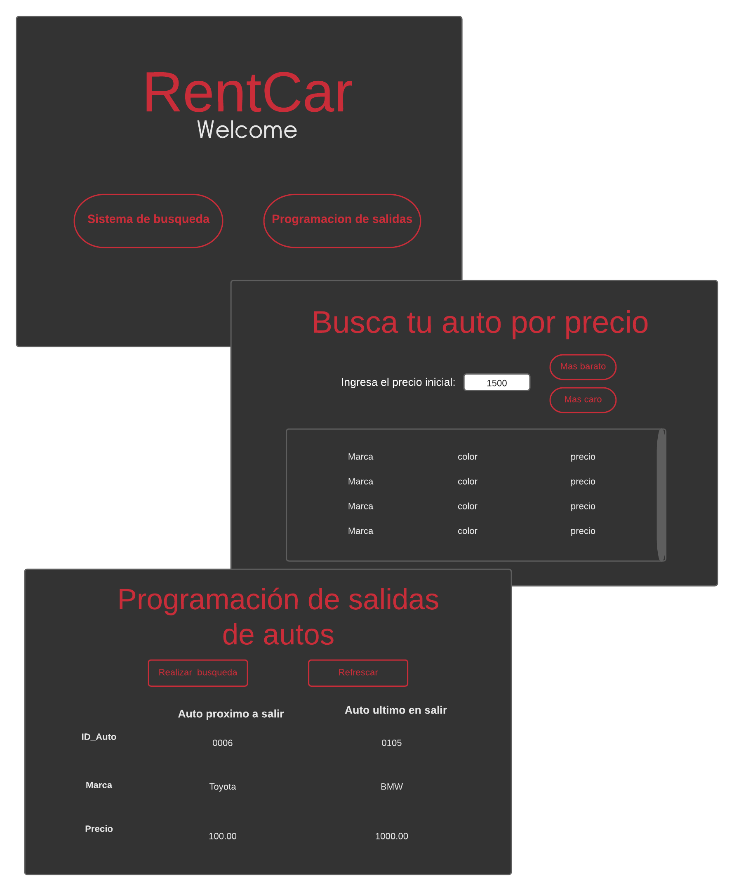

<!-- PROJECT LOGO -->
<br />
<p align="center">
  <a href="https://github.com/othneildrew/Best-README-Template">
    
  </a>

  <h3 align="center">RentCar App</h3>

  <p align="center">
    Aplicacion de escritorio para usuarios premium
  </p>
</p>


<!-- TABLE OF CONTENTS -->
<details open="open">
  <summary>Tabla de contenio</summary>
  <ol>
    <li>
      <a href="#about-the-project">Sobre el proyecto</a>
      <ul>
        <li><a href="#built-with">Construido con</a></li>
      </ul>
    </li>
    <li>
      <a href="#getting-started">Empecemos</a>
      <ul>
        <li><a href="#prerequisites">Prerequisitos</a></li>
        <li><a href="#installation">Instalacion</a></li>
      </ul>
    </li>
    <li><a href="#usage">Uso</a></li>
  </ol>
</details>


<!-- ABOUT THE PROJECT -->
## Sobre el proyecto

 

Esta aplicacion es desarrollada para usuarios premium de la empresa RentCar.
Nuestra aplicación se conectará a MongoDB Atlas, donde se encuentra la base de datos de la aplicacion web.

Se decidió utilizar árboles de búsqueda y colas, ambos hechos con listas enlazadas.

### Construido con

Se utilizo python 🐍 como lenguaje de programacion la cual se conecto con Mongo Atlas 🍃. 

Para conectar nuestra aplicación con la base de datos utilizamos las librerías pymongo que  contiene herramientas para interactuar con la base de datos MongoDB y dnspython que es un conjunto de herramientas de DNS para Python.

Documentacion:
* [PyMongo](https://pymongo.readthedocs.io/en/stable/)


<!-- GETTING STARTED -->
## Empecemos

Se dara la explicaion para clonar y utilizar esta aplicacion.

### Prerequisites

Se nesesita tener instalado python🐍 y pip.

* Instalamos pymongo
  ```sh
  pip install pymongo
  ```

* Instalamos dnspython
  ```sh
  pip install dnspython
  ```

### Installation

1. Clona el repositorio
   ```sh
   git clone https://github.com/Nikoll713/Aplicacion_RentCar.git
   ```

<!-- USAGE EXAMPLES -->
## Uso

Para probar el proyecto vaya a la carpeta Views, y haga correr el archivo paginaPrincipal.py.


